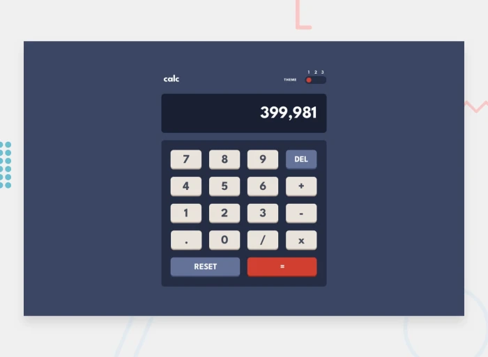

# Frontend Mentor - Interactive rating component solution

This is a solution to the [[Interactive rating component challenge on Frontend Mentor](https://www.frontendmentor.io/challenges/interactive-rating-component-koxpeBUmI](https://www.frontendmentor.io/challenges/calculator-app-9lteq5N29)). Frontend Mentor challenges help you improve your coding skills by building realistic projects. 

## Table of contents

- [Overview](#overview)
  - [The challenge](#the-challenge)
  - [Screenshot](#screenshot)
  - [Links](#links)
- [My process](#my-process)
  - [Built with](#built-with)
  - [What I learned](#what-i-learned)
  - [Continued development](#continued-development)
- [Author](#author)
- [Acknowledgments](#acknowledgments)

## Overview

This is a simple, interactive calculator app with a modern UI and three themes. The app allows users to perform basic arithmetic operations such as addition, subtraction, multiplication, and division. The calculator also supports functionalities like delete, reset, and equals. The app has a responsive design, making it suitable for various screen sizes.

### The challenge

The task was to build a calculator app that:
- Performs basic arithmetic operations.
- Has three switchable themes.
- Is responsive across different devices.

### Screenshot
Calculator: Desktop design 

Calculator: mobile design 

### Links

- Solution URL: [https://github.com/hoor23/https---github.com-hoor23-Calculator.git](https://github.com/hoor23/https---github.com-hoor23-Calculator.git)
- Live Site URL: [https://hoor23.github.io/https---github.com-hoor23-Calculator/](https://hoor23.github.io/https---github.com-hoor23-Calculator/)

## My process

### Built with

- **HTML**: Structuring the calculator layout.
- **CSS**: Styling the calculator, including animations and theme switching.
- **JavaScript**: Implementing calculator functionalities and theme toggling.

### What I learned

- **CSS Variables**: Used to create dynamic themes that can be easily changed using JavaScript.
- **JavaScript Event Handling**: Captured button clicks, handled input display, and calculated operations.
- **Responsive Design**: Ensured that the layout is adaptable to various screen sizes, from small mobile devices to desktops.

### Continued development

- **Scientific Calculator**: Plan to add more advanced operations like square roots, exponents, etc.
- **History Feature**: Add a feature to show the history of past calculations.
- **Improved User Experience**: Enhance button animations and user feedback for better interaction.

## Author

- Frontend Mentor - [hoor23](https://www.frontendmentor.io/profile/hoor23)

## Acknowledgments

Frontend Mentor: For providing great challenges to improve frontend skills.
